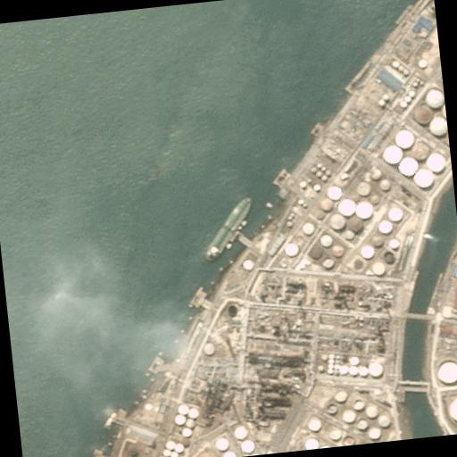
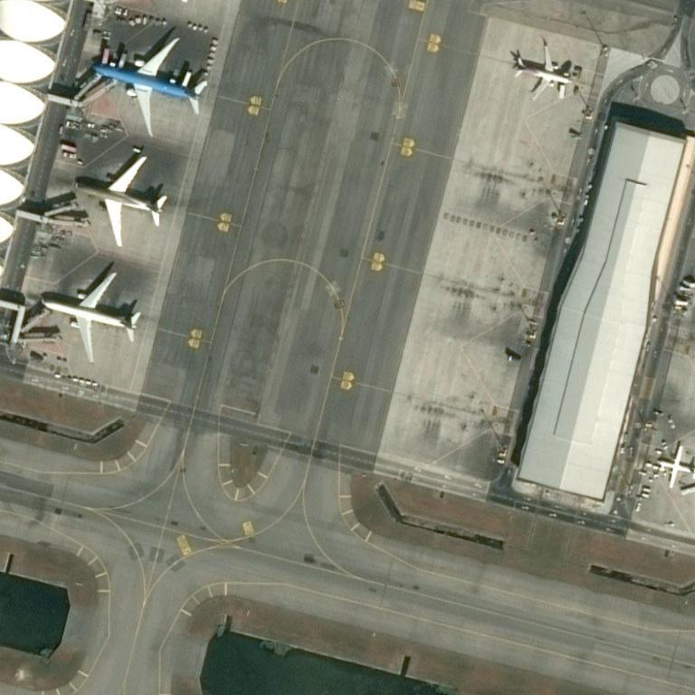
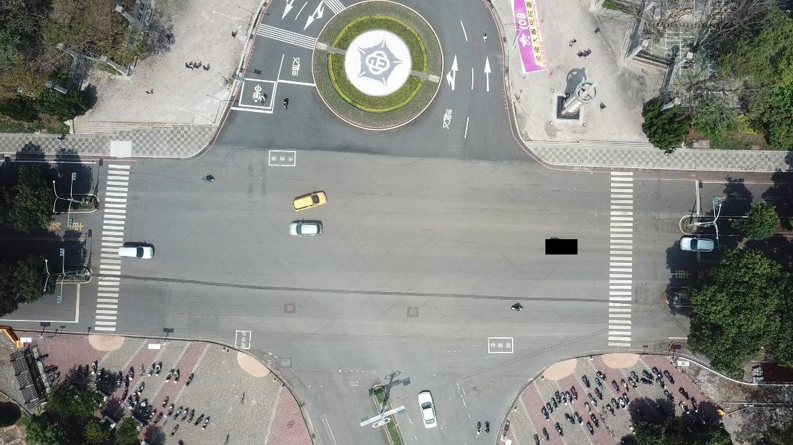

# Детектирование кораблей, машин и самолётов на изображениях

## Cоревнование на [kaggle](https://www.kaggle.com/competitions/how-machine-sees)
## Описание задачи
3 класса, машины, самолёты, корабли. \
Есть не большой размеченный датасет. \
Метрика mAP@50\
Пример из датасета:\

## Решение
Модель Faster_RCNN, фреймворк Detectron2. \
Модель дообучена на датасете, при обучении применялась аугментация, также данные чистились от других объектов(транспорта), т.к на тестовой выборке их представленно не было